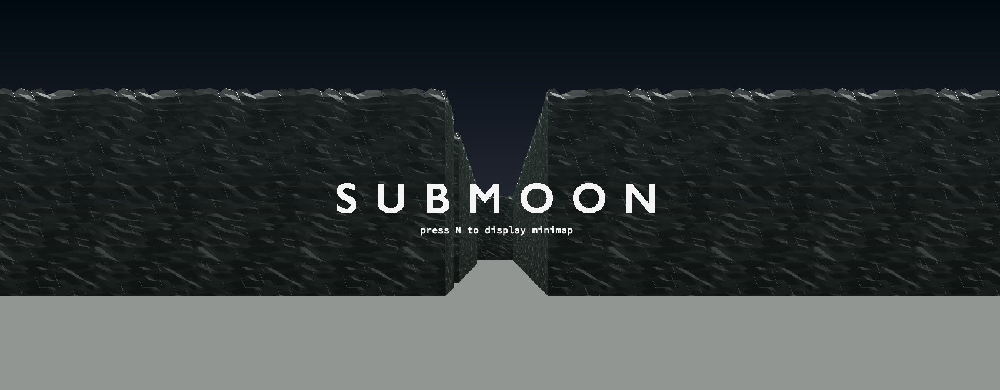

# Cub3D - Wolfenstein 3D inspired game



This project, cub3D, is inspired by the iconic first-person shooter game Wolfenstein 3D. It is implemented in C using the raycasting technique to create a 3D graphical representation of a maze-like world from a first-person perspective.

## Table of Contents
- [Overview](#overview)
- [Features](#features)
- [Installation](#installation)
- [Usage](#usage)
- [Controls](#controls)
- [Bonus Features](#bonus-features)
- [Contributors](#contributors)

## Overview
The cub3D project is part of the 42 school curriculum and aims to introduce students to the fundamentals of raycasting, a basic form of 3D rendering, as well as to improve their skills in graphics programming, parsing, and software architecture.

## Features
- **Basic Raycasting Engine**: Renders a 3D perspective of a maze-like environment using raycasting.
- **Texture Mapping**: Walls are textured with images from external files.
- **Sprite Rendering**: Supports sprite objects that can interact with the player.
- **Collision Detection**: Prevents the player from moving through walls.
- **Basic Game Mechanics**: Includes player movement, rotation, and interaction with the environment.
- **Error Handling**: Checks for and handles various errors gracefully.

## Installation
1. Clone the repository:
   ```bash
   git clone https://github.com/your-username/cub3D.git
   cd cub3D
   ```
2. Compile the project:
   ```bash
   make
   ```
## Usage
Run the program with a map file as argument:
```bash
./cub3D map/map_level0.cub
```

## Controls
- W: Move forward
- A: Move left
- S: Move backward
- D: Move right
- Left Arrow: Rotate left
- Right Arrow: Rotate right
- Up Arrow: Move forward
- Down Arrow: Move backward
- ESC: Exit the game


# Bonus features
### Compile the project:
   ```bash
   make bonus
   ```
### Run the program with a map file as argument:
```bash
./cub3D_bonus map_bonus/bonus_map_level1.cub
```
### Special features

#### Additional controls

- Mouse left click rotate the player.
  
#### Minimap
Display a minimap pressing M


#### Collectibles
Dynamic objets that are collectable


#### Interactive actions
Door opens by pressing SPACE if all the keys are collected


# Contributors
- Guillaume Bussiere
- [Jules Bernard](https://github.com/julesrb)
